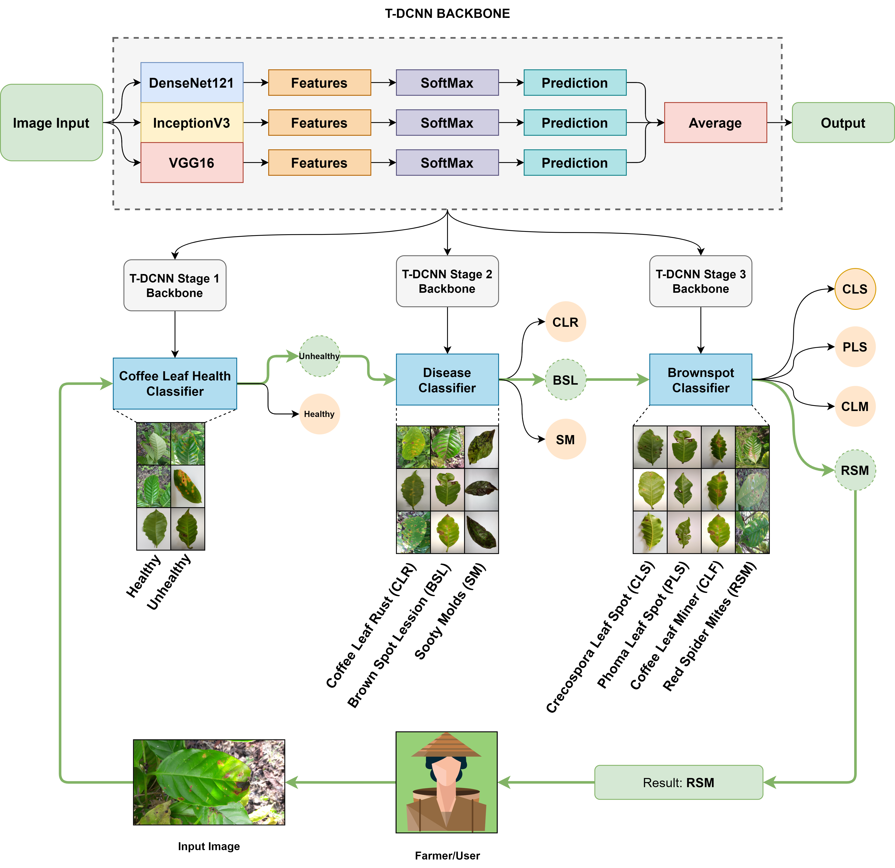

      

Starting from the story by one of our bangkit team members from Aceh [Muhammad Naufal Ariiq][3], who said that coffee business stakeholders in his area had difficulty identifying the moisture levels in green coffee beans quickly and accurately, besides that there were difficulties by the farmers in identifying diseases that existed in coffee plants and lack of insight in handling and preventing Disease. 

Our project is based on a problem that happens in one of the highest valued commodities in Indonesia, and that is coffee. By solving the problems, the commodity quantity and quality will be increased. And finally the economy in our society will be increased as well.

## Meet Our Team ## 
| No  | Name                     | University                                    | Learning Path      | Contact        |
|-----|--------------------------|-----------------------------------------------|--------------------|----------------|
| 1   | Mohamad Arsya Kaukabi    | Universitas Diponegoro                        | Machine Learning   | [Instagram][2] |
| 2   | Ivan Arsyaditya Prananda | Universitas Dian Nuswantoro                   | Machine Learning   | [Instagram][1] |
| 3   | Muhammad Naufal Ariiq    | Universitas Syiah Kuala                       | Machine Learning   | [Instagram][3] |
| 4   | M. Rizal Firmansyah      | Universitas Bina Sarana Informatika           | Mobile Development | [Instagram][4] |
| 5   | Muhammad Syaiful Rahman  | Universitas Telkom                            | Cloud Computing    | [Instagram][5] |
| 6   | Aqshol Afifi             | Universitas Islam Negeri Syarif Hidayatullah  | Cloud Computing    | [Instagram][6] |

[1]:https://www.instagram.com/ivnvan_/
[2]:https://www.instagram.com/arsyakaukabi/
[3]:https://www.instagram.com/muhammadnaufalariiq/
[4]:https://www.instagram.com/rizalfirman165/
[5]:https://www.instagram.com/iful_rahman/
[6]:https://www.instagram.com/aqsholafifi/

## Co-ffee Github Repo Links ##

**Machine Learning**
>**[Classification of Coffee Leaf Diseases](https://github.com/arsyakaukabi/Co-ffee_A)**

>**[Green Coffee Beans Moisture Level Detection](https://github.com/ivandityap/Co-ffee_MoistureDetection)**

**Cloud Computing**
>**[Disease classification API](https://github.com/xrizer/Co-ffee-Desease-API)**

>**[Coffee beans Moisture level detection API](https://github.com/xrizer/Co-ffee-Desease-API
)**

**Mobile Development**

>**[Project Android Studio](https://github.com/Rizalfirman165/co-ffee)**

## Graphical Abstract ##

Here is the proposed model for each features in Co-ffee

    <b>Fig 1</b> The stage-wise classification of coffee leaves with the trained backbones

    <b>Fig 2</b> Triple deep convolutional neural network model for moisture level detection

## Acknowledgment ##
Thanks to [Bangkit Academy](https://grow.google/intl/id_id/bangkit/). Without its support, this work would not have become possible.

